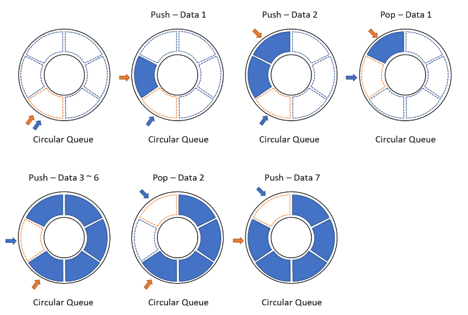
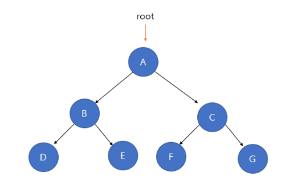
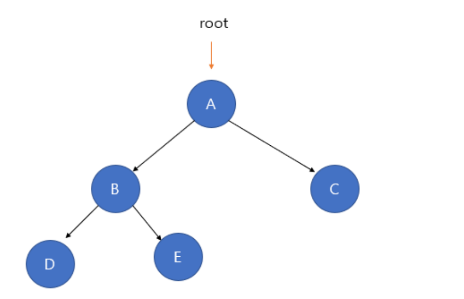
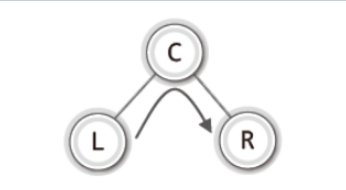
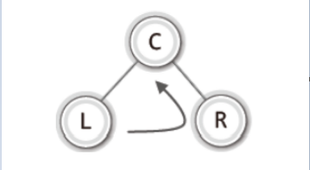
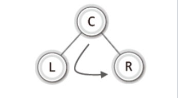
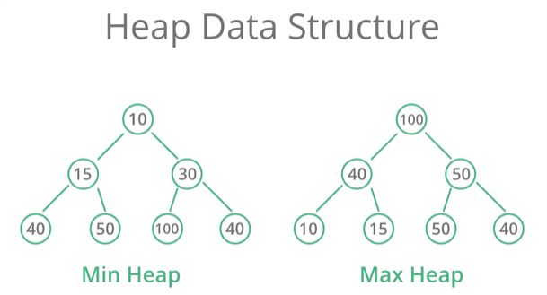

# 자료구조 (Data Structures)

자료구조에 대한 기본적인 개념과 관련된 주제들을 다루고 있습니다.<br>
자료구조에서는 데이터의 표현 및 데이터를 저장하는 방법을 설명합니다

## [시간복잡도 (Time Complexity)]
시간복잡도는 속도에 해당하는 알고지름의 수행시간 분석결과를 가르키며 연산 횟수를 샌 후 처리해야될 데이터 N 개에 대한 연산횟수의 함수를 구성합니다.

예시: 이진 탐색 (Binary Search)
이진 탐색은 정렬된 배열에서 중간 값과 비교하여 탐색 범위를 반으로 줄여가며 원하는 원소를 찾는 알고리즘입니다. 
```java
public int binarySearch(int[] arr,int target){
    int start = 0;
    int end = arr.length - 1;
    int mid;
    
    while(start <= end){
      mid = (start+end)/2;
      if(arr[mid] == target){ //핵심 비교연산
        return mid;
      }else if( arr[mid] > target){
        end = mid - 1;
      }else{
        start = mid + 1;
      }
    }
    return -1;
  }
```
모든 알고리즘에는 최선의 경우와 최악의 경우가 있는데 시간복잡도를 계산하기 위해선 최악의 경우를 선택해서 연산횟수의 함수를 구성합니다.

이진 탐색에서 핵심은 동등비교를 하는 비교연산에 있습니다. 이진 탐색 최악의 경우에 대한 시간복잡도를 구해보겠습니다.

처음에 데이터 개수가 N개 일때 1회 비교연산 진행<br>
데이터 수를 반으로 줄여 N/2일때  1회 비교연산 진행<br>
데이터 수를 반으로 줄여 N/4일때  1회 비교연산 진행 <br>
...<br>
데이터 수를 반으로 줄여 1일때 1회 비교연산 진행<br>

N이 1이 될때까지 나눈 횟수 K , 나눈 값이 1일때 비교연산 진행 1 이므로 시간 복잡도는 $T(n) = K+1$ 이며, K를 구해야 합니다.

$n*(1/2)^K = 1$    &rarr;  $n = 2^K$    &rarr;  $log_{2}n = log_{2}2^K$    &rarr; $log_{2}n = k$ 이므로 
이진탐색의 시간 복잡도는 $T(n) = log_{2}n + 1$ 입니다.

## [빅오표기법 (Big O Notation)]
빅오표기법은 알고리즘의 성능을 표현하는 수학적인 표기법으로, 최악의 경우에 얼마나 빠르게 실행되는지를 나타냅니다.<br>
시간복잡도가 $T(n) = n^2+2n+1$일 경우에 최고차항이 차지하는 연산 횟수 비율을 테이블로 정리했습니다.

|   n     |        $n^2$    |   $2n$   |     $T(n)$   | $n^2$의 비율|
|--------:|----------------:|---------:|-------------:|------------:|
|       10|              100|        20|           120|       83.33%|
|      100|           10,000|       200|        10,200|       98.04%|
|    1,000|        1,000,000|     2,000|     1,002,000|       99.80%|
|   10,000|       10,000,000|    20,000|   100,020,000|       99.98%|
|  100,000|   10,000,000,000|   200,000|10,000,200,000|       99.99%|

n이 증가함에 따라서 2n+1이 미치는 영향은 미미해지므로 다음과 같이 시간복잡도를 간략화 할 수 있으며 $T(n) = n^2$ 이를 빅-오 표기법으로 표현하면 다음과 같습니다 $O(n^2)$.
빅-오 표기들의 성능(수행시간, 연산횟수)의 대소를 정리하면 다음과 같습니다.<br>

<p align="center">
  
  <br>
  $O(l)$ $<$ $O(log_{2}n)$ $<$ $O(n)$ $<$ $O(nlog_{2}n)$ $<$ $O(n^2)$ $<$ $O(n^3)$ $<$ $O(2^n)$
</p>

## [재귀함수 (Recursion)]

재귀함수는 함수가 자기 자신을 호출하는 특별한 형태의 함수입니다.
재귀함수 호출을 쉽게 이해하기 위해선 함수가 호출되면 해당 함수의 복사본을 만들어서 실행하는 구조이다.


------
예시 : 하노이 타워<br>
<p align="center">
  
</p>
하노이 타워는 원판의 갯수가 증가해도 일련의 과정을 반복하기 때문에대표적인 재귀함수 사용 예시입니다. 
원판의 갯수 N개이며 출발지 A 도착지 C 경유지 B로 예시를 들겠습니다.

1. 제일 큰 원반을 제외한 n-1개의 원반을 A에서 B로 이동
2. 제일 큰 원반을 A에서 C로 이동
3. 제일 큰 원반을 제외한 n-1개의 원반을 B에서 C로 이동

위의 규칙처럼 원반 5개 옮기는 과정은 4개,3개 옮길때 과정이 포함되어있는 과정이므로 일련의 과정을 반복합니다. 단지 출발지와 경유지 도착지만 변경될 뿐입니다.
```java
void hanoiTowerMove(int num,String a,String b,String c){
    if(num == 1){
      log.info("{}번 {} -> {} 이동",num,a,c); //2번과정
    }else{
      hanoiTowerMove(num - 1 , a,c,b);  // 1번 과정 
      log.info("{}번 {} -> {} 이동",num,a,c);
      hanoiTowerMove(num - 1 , b,a,c); //3번 과정
    }
  }
```
## [연결 리스트 (Linked List)]
ADT(Abstract Data Type)는 C언어나 JAVA에서 표현하는 자료형이 아닌 순수한 기능을 나열한 것입니다.
어떠한 자료구조이건 간에 자료구조의 구현 과 구현된 자료구조의 활용을 완전히 구분되도록 ADT를 정의해야 합니다.
리스트에서 순수한 기능은 4가지 입니다.
1. 입력
2. 첫번째 데이터 조회
3. 다음 데이터 조회
4. 삭제
<br>
조회에서 2,3 번으로 분리한 이유는 모든데이터 순회 후 인덱스를 초기화 하기 위해서 기능을 분리하였습니다.

### 배열을 이용한 리스트
```java
@Slf4j
public class ArrayList<T> {

  public T[] array;
  int numOfData;
  int curPosition;

  public ArrayList(T[] array) {
    this.array = array;
    this.numOfData = 0;
    this.curPosition = -1;
  }

  public void insert(T data){
    if(numOfData >= array.length) {
      log.error("데이터를 더이상 저장할 수 없습니다.");
      return;
    }
    array[numOfData++] = data;
  }

  public T first(){
    if(numOfData == 0) {
      log.error("저장된 데이터가 없습니다.");
      return null;
    }
    curPosition = 0;
    return array[curPosition];
  }

  public T next(){
    if(curPosition >= array.length - 1 ){
      log.error("다음 데이터가 없습니다.");
      return null;
    }
    return array[++curPosition];
  }

  public T remove(){
    int pos = curPosition;
    int num = numOfData;
    T removeData = array[curPosition];

    for( int i = pos ; i< num - 1 ; i++){
      array[i] = array[i+1];

      //마지막 데이터를 땡겨왔으니 메모리에서 제거해줘야한다.
      if( i == num - 2 ){
        array[i+1] = null;
      }
    }
    numOfData--;
    curPosition--;
    return removeData;
  }
}
```

### 노드를 이용한 연결 리스트
배열을 이용한 리스트에 단점은 배열의 길이가 가변적이지 않아 배열의 길이 이상으로 데이터를 추가할 수 없습니다. 이러한 단점을 해결하기 위해 메모리에 노드를 할당하여 각각의 노드를 연결한 형태의 리스트를 구현할 수 있습니다.
필자가 구현할 연결 리스트는 헤드가 존재하며, 해당 헤드는 더미 노드를 가지고 있는 형태이다.
```java
public class LinkedList<T> {
  Node<T> head;
  Node<T> cur;
  Node<T> before;
  int numOfData;

  Comparator<T> comp;

  public LinkedList() {
    this.head = new Node<>();
    this.cur = null;
    this.before = null;
    numOfData = 0;
  }

  void insert(T data){
    Node<T> newNode = new Node<>(data);

    //정렬문
    Node<T> point = head;

    while(point.getNext() != null && comp.compare(point.getNext().getData(),newNode.getData()) != 0){
      point = point.getNext();
    }

    newNode.setNext(point.getNext());
    point.setNext(newNode);
    numOfData++;
  }

  T first(){
    if(head.getNext() == null){
      log.error("저장된 데이터가 없습니다.");
      return null;
    }
    before = head;
    cur = head.getNext();
    return cur.getData();
  }

  T next(){
    if(cur == null || cur.getNext() == null){
      log.error("저장된 데이터가 없습니다.");
      return null;
    }
    before = cur;
    cur = cur.getNext();
    return cur.getData();
  }
  T remove(){
    T data = cur.getData();
    before.setNext(cur.getNext());
    cur = before;
    return data;
  }

  void setSortRule(Comparator<T> comp){
    this.comp = comp;
  }
}
```

### 더미 노드를 이용한 양방향 연결 리스트
양뱡향 연결 리스트는 각 노드가 이전노드와 다음노드를 가리키는 구조를 가진 자료 구조입니다. 양방향으로 탐색이 가능하며,<br>
head와 tail에 더미노드를 사용하여 입력,삭제시 예외 처리를 간소화할 수 있습니다.(마지막 데이터를 삭제할때 같은 상황을 간소화 가능) 

```java
@Slf4j
public class DbDummyLinkedList<T> {

  Node<T> head;
  Node<T> tail;
  Node<T> cur;

  int numOfData;

  public DbDummyLinkedList() {
    this.head = new Node<>();
    this.tail = new Node<>();

    this.head.setNext(tail);
    this.head.setPrev(null);
    this.tail.setNext(null);
    this.tail.setPrev(head);

    this.cur = null;
    numOfData = 0;
  }

  void insert(T data){
    Node<T> newNode = new Node<>(data);

    tail.getPrev().setNext(newNode);
    newNode.setPrev(tail.getPrev());

    tail.setPrev(newNode);
    newNode.setNext(tail);

    numOfData++;
  }

  T first(){
    if(head.getNext() == tail) return null;
    cur = head.getNext();
    return cur.getData();
  }

  T next(){
    if(cur.getNext() == tail) return null;
    cur = cur.getNext();
    return cur.getData();
  }

  T previous(){
    if(cur.getPrev() == head) return null;
    cur = cur.getPrev();
    return cur.getData();
  }

  T remove(){
    if(cur == this.head) {
      log.error("삭제할 데이터가 없습니다.");
    }
    Node<T> ref = cur;
    T data = ref.getData();
    cur.getNext().setPrev(cur.getPrev());
    cur.getPrev().setNext(cur.getNext());

    cur = cur.getPrev();
    numOfData--;

    return data;
  }

  int count(){
    return numOfData;
  }

}
```

## [스택 (Stack)]
스택은 데이터를 저장하거나 검색하는 기능 중 하나로, 나중에 추가된 데이터가 먼저 제거되는 자료구조입니다. 이를 Last In, First Out (LIFO) 원칙이라고 합니다. 스택은 데이터를 쌓아 올리듯 쌓아 올려지는 구조를 가지고 있습니다.

### 기본적인 동작

- **Push:** 스택에 데이터를 추가하는 연산을 의미합니다.
- **Pop:** 스택에서 데이터를 제거하는 연산을 의미합니다.
- **Top:** 스택의 가장 위에 있는 데이터를 가리키는 포인터입니다.
- **IsEmpty:** 스택이 비어 있는지 확인하는 연산을 수행합니다.

### 배열을 이용한 스택

```java
@Slf4j
public class ArrayBaseStack<T> {

  T[] array;

  int topIndex;

  public ArrayBaseStack(T[] array) {
    this.array = array;
    topIndex = -1;
  }

  boolean isEmpty(){
    if(topIndex == -1){
      return true;
    }else{
      return false;
    }
  }

  void push(T data){
    if(topIndex + 1 >= array.length) {
      log.error("더 이상 데이터를 추가할 수 없습니다.");
      return;
    }

    array[++topIndex] = data;
  }

  T pop(){
    if(isEmpty()){
      log.error("저장된 데이터가 없습니다.");
      return null;
    }

    return array[topIndex--];
  }

  T peek(){
    if(isEmpty()){
      log.error("저장된 데이터가 없습니다.");
      return null;
    }
    return array[topIndex];
  }
}
```

### 연결리스트를 이용한 스택
연결리스트를 이용한 스택을 구현할 때 head가 있는 연결리스트를 이용해 구현할 수 있다.

```java
@Slf4j
public class ListBaseStack<T> {

  Node<T> head;

  public ListBaseStack() {
    this.head = null;
  }

  public boolean isEmpty(){
    return this.head == null;
  }

  void push(T data){
    Node<T> newNode = new Node<>(data);

    newNode.setNext(head);
    head = newNode;
  }

  T pop(){
    if(isEmpty()){
      log.error("저장된 데이터가 없습니다.");
      return null;
    }
    Node<T> ref = head;
    T data = ref.getData();
    head = head.getNext();
    return data;
  }

  T peek(){
    if(isEmpty()){
      log.error("저장된 데이터가 없습니다.");
      return null;
    }
    return head.getData();
  }
}
```
## [큐 (Queue)]
큐는 데이터를 FIFO(First-In-First-Out) 방식으로 저장하고 관리하는 자료 구조입니다. 이 자료 구조는 데이터가 들어온 순서대로 처리할 때 유용하게 사용됩니다. 주로 대기열을 모델링하거나 작업을 조정하는 데 사용됩니다.

### 기본적인 동작
- **Enqueue**: 큐에 데이터를 추가하는 작업입니다. 새로운 데이터는 항상 큐의 뒤쪽에 추가됩니다.
- **Dequeue**: 큐에서 데이터를 제거하고 반환하는 작업입니다. 가장 먼저 추가된 데이터가 먼저 제거됩니다.
- **Peek**: 큐의 가장 앞에 있는 데이터를 반환하지만 제거하지 않는 작업입니다. 큐의 첫 번째 데이터를 확인할 수 있습니다.

### 배열을 이용한 큐
배열을 이용한 큐는 데이터 추가 시 front,rear가 해당 인덱스를 가르킨다. 하지만 해당 큐를 모두 채우거나 비울 경우 
front,rear의 규칙(front,rear가 붙어있다)이 동일하여 해당 큐가 비어있는지 차있는지 알 수 없다. 그래서 원형 큐를 이용해 첫번째 인덱스는 비운상태로 데이터를 추가해 나간다.
데이터를 추가할 땐 rear를 한칸 이동 후 데이터를 추가하며, 데이터를 추출할 땐 front를 한칸 이동 후 해당 데이터를 추출한다.

```java
@Slf4j
public class ArrayQueue<T> {

  T[] arr;
  int front;
  int rear;

  public ArrayQueue(T[] arr) {
    this.arr = arr;
    this.front = 0;
    this.rear = 0;
  }

  public boolean isEmpty(){
    return front == rear;
  }

  public void enqueue(T data){
    if(nextPosIdx(rear) == front){
      throw new IllegalStateException("데이터가 꽉 찼습니다.");
    }
    rear = nextPosIdx(rear);
    arr[rear] = data;
  }

  public T dequeue(){
    if(isEmpty()){
      log.error("데이터가 없습니다.");
      return null;
    }
    front = nextPosIdx(front);
    T data = arr[front];
    arr[front] = null;
    return data;

  }

  public T peek(){
    if(isEmpty()){
      log.error("데이터가 없습니다.");
      return null;
    }
    return arr[nextPosIdx(front)];
  }

  private int nextPosIdx(int pos){
    if(pos == arr.length - 1 ){
      return 0;
    }else{
      return pos + 1;
    }
  }
}
```

### 연결리스트를 이용한 큐
데이터를 추가하거나 추출하는 방식은 배열을 이용한 방식과 동일하며 , 첫번째를 비우지 않아도 된다.
```java
@Slf4j
public class ListBaseQueue<T> {
  Node<T> front;
  Node<T> rear;

  public ListBaseQueue() {
    this.front = null;
    this.rear = null;
  }

  public boolean isEmpty(){
    return front == null;
  }

  public void enqueue(T data){
    Node<T> newNode = new Node<>(data);
    if(isEmpty()){
      front = newNode;
      rear = newNode;
    }else{
      rear.setNext(newNode);
      rear = newNode;
    }
  }

  public T dequeue(){
    if(isEmpty()){
      log.error("데이터가 없습니다.");
      return null;
    }

    T data = front.getData();
    front = front.getNext();

    return data;
  }

  public T peek(){
    if(isEmpty()){
      log.error("데이터가 없습니다.");
      return null;
    }

    return front.getData();
  }
}
```

### 덱(Deque)
덱(Deque)은 양쪽 끝에서 삽입과 삭제가 모두 가능한 자료 구조입니다. "Double-ended queue"의 약어로, 큐와 스택의 특성을 모두 갖고 있습니다. 덱은 양쪽에서 모두 데이터를 처리할 수 있기 때문에 다양한 상황에서 유용하게 사용됩니다.

#### 기본적인 동작
- **Push Front**: 덱의 앞쪽에 데이터를 추가합니다.
- **Push Back**: 덱의 뒤쪽에 데이터를 추가합니다.
- **Pop Front**: 덱의 앞쪽에서 데이터를 제거하고 반환합니다.
- **Pop Back**: 덱의 뒤쪽에서 데이터를 제거하고 반환합니다.
- **Peek Front**: 덱의 앞쪽에 있는 데이터를 반환하지만 제거하지 않습니다.
- **Peek Back**: 덱의 뒤쪽에 있는 데이터를 반환하지만 제거하지 않습니다.

```java
@Slf4j
public class Deque<T> {

  Node<T> front;
  Node<T> rear;

  public Deque() {
    this.front = null;
    this.rear = null;
  }

  public boolean isEmpty(){
    return front == null;
  }

  public void frontEnqueue(T data){
    Node<T> newNode = new Node<>(data);
    if(isEmpty()){
      rear = newNode;
    }else{
      front.setPrev(newNode);
    }
    newNode.setNext(front);
    front = newNode;
  }
  public void endEnqueue(T data){
    Node<T> newNode = new Node<>(data);

    if(isEmpty()){
      front = newNode;
    }else{
      rear.setNext(newNode);
    }
    newNode.setPrev(rear);
    rear = newNode;
  }

  public T frontDequeue(){
    if(isEmpty()){
      log.error("데이터가 없습니다.");
      return null;
    }
    T data = front.getData();
    front = front.getNext();
    if(front == null){
      rear = null;
    }else{
      front.setPrev(null);
    }
    return data;
  }

  public T endDequeue(){
    if(isEmpty()){
      log.error("데이터가 없습니다.");
      return null;
    }
    T data = rear.getData();
    Node<T> prev = rear.getPrev();
    rear = rear.getPrev();
    if(rear ==  null){
      front = null;
    }else{
      rear.setNext(null);
    }
    return data;
  }

  public T frontPeek(){
    if(isEmpty()){
      log.error("데이터가 없습니다.");
      return null;
    }
    return front.getData();
  }

  public T endPeek(){
    if(isEmpty()){
      log.error("데이터가 없습니다.");
      return null;
    }
    return rear.getData();
  }
}
```

## [트리 (Tree)]
트리는 계층적인 구조를 표현하는 자료구조로, 노드(node)들의 집합으로 이루어져 있습니다. 각 노드는 하나의 부모(parent) 노드와
여러 개의 자식(child) 노드를 가질수 있습니다. 트리 구조에서는 한 노드가 여러 개의 자식을 가질 수 있찌만, 부모는 하나만 가질 수 있습니다.

### 트리의 구성 요소
- **루트 노드 (Root Node)**: 트리의 최상위에 있는 노드로, 다른 모든 노드는 이 루트 노드로부터 시작합니다.
- **부모 노드 (Parent Node)**: 다른 노드에게 연결된 상위 노드를 가리킵니다.
- **자식 노드 (Child Node)**: 부모 노드에게 연결된 하위 노드를 가리킵니다.
- **리프 노드 (Leaf Node)**: 자식을 가지지 않는 노드로, 트리의 맨 끝에 위치합니다.
- **가지 (Branch)**: 루트에서부터 리프까지 이어지는 경로를 나타냅니다.

### 이진 트리(Binary Tree)와 서브 트리(Sub Tree)
#### 이진 트리
이진 트리는 다음 두 조건을 만족해야 합니다.
1. 루트 노드를 중심으로 두개의 서브 트리로 나뉘어 진다.
2. 나뉘어진 두 서브 트리도 모두 이진트리어야 한다.

- **포화 이진 트리(Full Binary Tree)**: 모든 레벨이 꽉 찬 이진 트리이다.
 


- **완전 이진 트리(Complete Binary Tree)**: 모든 레벨이 꽉 찬 상태는 아니지만 왼쪽부터 노드와 공(empty)노드로 차곡차곡 빈 틈 없이 노드가 채워진 이진트리이다.
  

#### 이진 트리 자료구조의 ADT
- **MakeBTreeNode**: 이진 트리 노드를 생성한다.
- **GetData**: 노드에 저장된 데이터를 반환한다.
- **SetData**: 노드에 데이터를 저장한다.
- **GetLeftSubTree**: 왼쪽 서브 트리를 반환한다.
- **GetRightSubTree**: 오른쪽 서브 트리를 반환한다.
- **MakeLeftSubTree**: 왼쪽 서브 트리를 연결한다.
- **MakeRightSubTree**: 오른쪽 서브 트리를 연결한다.

```java
public class BinaryTree<T> {

  BinaryTreeNode<T> makeBTreeNode(){
    BinaryTreeNode<T> bNode = new BinaryTreeNode<>();
    bNode.left = null;
    bNode.right = null;
    return bNode;
  }
  public T getData(BinaryTreeNode<T> bt) {
    return bt.getData();
  }

  public void setData(BinaryTreeNode<T> bt,T data) {
    bt.setData(data);
  }

  BinaryTreeNode<T> getLeftSubTree(BinaryTreeNode<T> bt){
    return bt.getLeft();
  }

  BinaryTreeNode<T> getRightSubTree(BinaryTreeNode<T> bt){
    return bt.getLeft();
  }

  void makeLeftSubTree(BinaryTreeNode<T> main,BinaryTreeNode<T> sub){
    if(main.getLeft() != null) main.setLeft(null);
    main.setLeft(sub);
  }

  void makeRightSubTree(BinaryTreeNode<T> main,BinaryTreeNode<T> sub){
    if(main.getRight() != null) main.setRight(null);
    main.setRight(sub);
  }
}
```

### 이진 트리의 순회(Traversal)
이진 트리를 대상으로 하는 대표적인 순회의 세 가지 방법은 다음과 같다.
- **전위 순회(Preorder Traversal)**: 루트 노드를 먼저
- **중위 순회(Inorder Traversal)**: 루트 노드를 중간에
- **후위 순회(PostOrder Traversal)**: 루트 노드를 마지막에

#### 중위 순회(Inorder Traversal)
<br>
1. 왼쪽 서브 트리의 순회
2. 루트 노드의 방문
3. 오른쪽 서브 트리의 순회

```java
  static void inorderTraverse(BinaryTreeNode<Integer> bt){
    if(bt == null) return; //bt가 null 이면 재귀 탈출

    inorderTraverse(bt.getLeft());
    log.info("data : {}",bt.getData());
    inorderTraverse(bt.getRight());
  }
```

#### 후위 순회(Inorder Traversal)
<br>
1. 왼쪽 서브 트리의 순회
2. 오른쪽 서브 트리의 순회
3. 루트 노드의 방문
```java
  static void postorderTraverse(BinaryTreeNode<Integer> bt){
    if(bt == null) return; //bt가 null 이면 재귀 탈출

    postorderTraverse(bt.getLeft());
    postorderTraverse(bt.getRight());
    log.info("data : {}",bt.getData());
  }
```


#### 전위 순회(Inorder Traversal)
<br>
1. 루트 노드의 방문
2. 왼쪽 서브 트리의 순회
3. 오른쪽 서브 트리의 순회
```java
  static void preorderTraverse(BinaryTreeNode<Integer> bt){
    if(bt == null) return; //bt가 null 이면 재귀 탈출
        
    log.info("data : {}",bt.getData());
    preorderTraverse(bt.getLeft());
    preorderTraverse(bt.getRight());
  }
```
## [우선순위 큐 와 힙 (Priority Queue and Heap) ]
우선순위 큐는 우선순위를 가진 항목들을 저장하고, 가장 높은 우선순위를 가진 항목을 먼저 꺼내어 처리하는 자료구조이다.

### 우선순위 큐의 기능
- `insert(item, priority)`: 항목과 해당 항목의 우선순위를 큐에 삽입합니다.
- `delete()`: 가장 높은 우선순위를 가진 항목을 큐에서 삭제하고 반환합니다.

### 우선순위 큐의 구현 방법
- 배열(Array) 기반 구현
- 연결 리스트(Linked List) 기반 구현
- 힙(Heap) 기반 구현

## 힙(Heap)
힙은 우선순위 큐를 구현하기 위한 자료구조 중 하나로, 모든 노드에 저장된 값은 자직 노드에 저장된 값보다 크거나 같아야하며 완전 이진 트리이다. 즉 루트 노드에 저장된 값이 가장 커야한다.
힙은 연결리스트가 아닌 배열을 이용하여 구현해야 한다. 연결리스트를 사용할 경우 마지막 위치에 노드를 추가하는것이 쉽지 않다.
- 최대 힙(Heap) : 루트 노드로 올라갈수록 저장된 값이 커지는 완전이진트리
- 최소 힙(Heap) : 루트 노드로 올라갈수록 저장된 값이 작아지는 완전이진트리
  
최소 힙을 이용하여 우선순위 큐를 구현해 볼려고 한다. 우선순위가 높은 노드가 위쪽에 위치한다.



```java
@Slf4j
public class UsefulHeap<T> {
  Comparator<? super T> comp;
  int numOfData;
  T[] heapArr;

  public UsefulHeap(Comparator<? super T> comp, T[] heapArr) {
    this.comp = comp;
    this.numOfData = 0;
    this.heapArr = heapArr;
  }

  public boolean isEmpty(){
    return numOfData == 0 ;
  }

  public int getParentIdx(int idx){
    //부모의 인덱스
    return idx/2;
  }
  public int getLeftChildIdx(int idx){
    //왼쪽 자식의 인덱스
    return idx*2;
  }
  public int getRightChildIdx(int idx){
    //오른쪽 자식의 인덱스
    return getLeftChildIdx(idx)+1;
  }

  public int getHighPriorityChildIdx(int idx){
    if(getLeftChildIdx(idx) > numOfData){
      //힙은 완전 이진 트리로써 왼쪽 노드가 없으면 자식노드가 없는걸 알 수 있다.
      return 0;
    }else if(getLeftChildIdx(idx) == numOfData){
      //힙은 완전 이진 트리로써 왼쪽 노드가 저장된 데이터의 인덱스와 같다면 자식노드가 왼쪽노드만 존재한다는걸 알 수 있다.
      return getLeftChildIdx(idx);
    }else{
      if(comp.compare(heapArr[getLeftChildIdx(idx)],heapArr[getRightChildIdx(idx)]) < 0){
        //비교 함수를 정의하여 우선순위 결정
        return getRightChildIdx(idx);
      }else{
        return getLeftChildIdx(idx);
      }
    }
  }

  public void insert(T data){
    int idx = numOfData + 1;

    while(idx != 1){
//      if(heapArr[getParentIdx(idx)].getPriority().getPri() > priority.getPri()){
      if(comp.compare(data,heapArr[getParentIdx(idx)]) > 0){
        /* 힙에서 데이터 저장 시 마지막 노드에 저장 후 부모노드와 우선순위를 비교하여 우선순위가 높을 경우
         * 데이터 순서를 변경한다. 데이터 입력시 시간복잡도는 O(logN)
         * */
        heapArr[idx] = heapArr[getParentIdx(idx)];
        idx = getParentIdx(idx);
      }else break;
    }

    heapArr[idx] = data;
    numOfData++;
  }

  public T delete(){
    int parentIdx = 1;
    T deleteData = heapArr[parentIdx];
    T lastData = heapArr[numOfData];
    int childIdx;
    while((childIdx = getHighPriorityChildIdx(parentIdx)) != 0){
//      if(lastEle.getPriority().getPri() > childEle.getPriority().getPri()){
      if(comp.compare(lastData,heapArr[childIdx]) < 0){
        /* 힙에서 데이터 삭제 시 우선순위가 가장높은 데이터를 삭제하고 마지막 노드를 루트노드에 위치로 이동한뒤
         * 우선순위가 높은 자식노드와 비교하여 우선순위가 낮을 경우 데이터 순서를 변경한다.                
         * */
        heapArr[parentIdx] = heapArr[childIdx];
        parentIdx = childIdx;
      }else break;
    }

    heapArr[parentIdx] = lastData;
    heapArr[numOfData] = null;
    numOfData--;
    return deleteData;
  }

  void preorderTraverse(int idx){
    if( idx > numOfData) return ;

    T data = heapArr[idx];
    log.info("data : {}",data);
    preorderTraverse(getLeftChildIdx(idx));
    preorderTraverse(getRightChildIdx(idx));
  }

}
```
